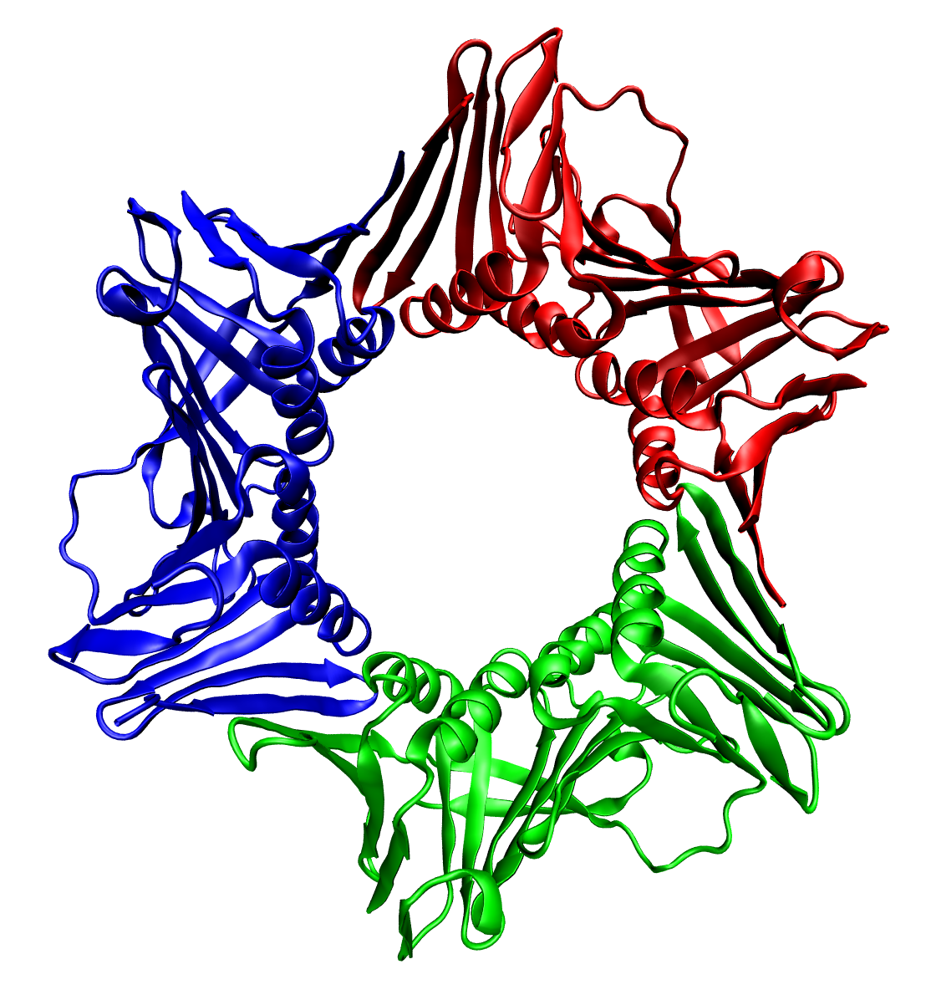

# GENOME-BASED PREDICTION OF BREAST CANCER CELL RESPONSE
> Given the genomic features of a cell line, can we predict if it is sensitive or resistant to a particular treatment? <br>
  Is it possible to identify a minimal set of features (genes) that predict the response?

<p align="center">
    
    
</p>

<a name="description"/>

## Description
Here the results of a statistical analysis of breast cancer data are presented. This project was carried out during the `Applied Statistics` course at the `Politecnico di Milano`. The relevant datasets used for this project can be found through the [Cancer Cell Line Encyclopedia (CCLE)](https://depmap.org/portal/download/) database. The CCLE is a multi-institutional effort to develop a comprehensive database for varying types of cancer. **Our main objective was to infer which genomic aspects most influence the sensitivity to antitumoral drugs.**

<a name="motivation"/>

## Motivation and Methodology
The goal of this project is to understand the link between the genetic and physiological data of a patient and how efficiently cancer-treating drugs perform on their cells. 

<p align="center">
    
</p>

- First, patients were divided into groups based on the effectiveness of the treatments on their cells. 
- Then, we tried to explain these groups with their gene expression.

To simplify the project scope, the analysis is strictly limited to patients having breast cancer, as opposed to all cancers which were present in the main dataset. 

<a name="why_breast"/>

## Why Breast Cancer?
<p align="center">
    
</p>

<a name="assumptions"/>

## Assumptions and terminology 
In the following sections, the terms "AUC" or "AUC score" are equivalent to "drug efficacy". AUC actually refers to the Area Under the dose-response Curve. These value should therefore not be understood as precise indicator of the effectiveness of treatments on patients, but as the result of in-vitro studies.

<a name="requirements"/>

## Requirements 
The project itself uses the following files from the CCLE database:
- *data_clinical_patient.txt*
- *data_clinical_sample.txt*
- *data_drug_treatment_auc.txt*
- *data_mrna_seq_rpkm.txt*

For seamless integration with the existing code, download and save these files in a directory denoted `Dataset` stored in the root. 

On the R side, loading the project in R Studio should prompt to load any missing packages you have.  

A collection of utilities and preprocessing scripts are included in the utilities folder of the project. 

*Data preprocess:* treatments with insufficient data were removed, and finally missing values were filled.
You can find the obtained datasets in the `Dataset` folder.

<a name="results"/>

## Results

### Clustering cell lines by treatment response

The aim of this step is to divide the patients according to the effectiveness of the treatments. For example, we could try to obtain a group where all treatments are effective and one where treatments generally do not work. Remember we define the drug performance as in-vitro efficacy (measured by AUC scores). 

Using the implemented Shiny app, you can view the clusters obtained with a hierarchical approach or with a non-hierarchical one.


To run this Shiny app, you can clone the git repository and then use `runApp()`:

```R
# First, clone the repository with git. 
# If you have cloned it into ~/clusters
setwd("~/clusters")
runApp()
```
Alternatively, you can use `runGitHub`.

```R
runGitHub("GENOME-BASED-PREDICTION", "rstudio", subdir = "clusters/")
```


